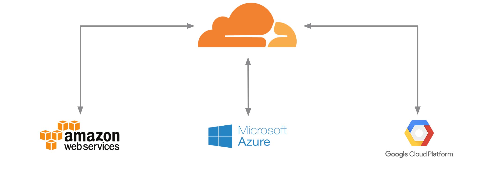

# How to build a multi-cloud website running on AWS, Azure and Google Cloud, with Terraform and Cloudflare for free

Deploying a multicloud website in Amazon Web Services (AWS), Microsoft Azure & Google Cloud Platform (GCP) using Terrraform and Cloudflare.

**aws-main.tf** --> Create AWS network components, security rules and EC2 instance

**aws-user-data.sh** --> BASH user data script to install Apache in AWS EC2 instance

**aws-variables.tf** --> AWS variables

**azure-auth.tf** --> Azure authentication variables 

**azure-main.tf** --> Create Azure network components, security rules and virtual machines

**azure-user-data.sh** --> BASH user data script to install Apache in Azure Virtual Machine

**azure-variables.tf** --> Azure variables

**cloudflare-dns.tf** --> Configure Cloudflare provider and create DNS records

**cloudflare-variables.tf** --> Cloudflare variables

**common-variables.tf** --> shared variables

**gcp-main.tf** --> Create GCP network components, security rules and Compute instance

**gcp-user-data.sh** --> BASH user data script to install Apache in GCP Compute instance

**gcp-variables.tf** --> GCP variables

**terraform.tfvars** --> cloud credentials
